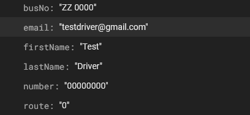
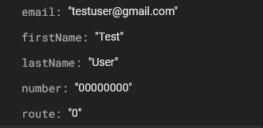

# Database Documentation
This documentation covers the database architecture you need to setup along with necessary steps to configure your firebase project in order to get the app connected with firebase up and running.

## Configuration Steps

1. Create a Firebase project.
2. Enable Firestore, Authentication and Realtime Database.
3. In your project settings, under the General tab, scroll down to find the "Your apps" section.
3. Click on add app to create two apps, one andriod app and one web app.
4. Click on the andriod app and download 'google-services.json' file into your Yatrack folder.'

4. Choose the Web app configuration and copy it, it will look something like this:
```bash
const firebaseConfig = {
    apiKey: "your-api-key",
    authDomain: "your-app-id.firebaseapp.com",
    databaseURL: "https://your-app-id.firebaseio.com",
    projectId: "your-app-id",
    storageBucket: "your-app-id.appspot.com",
    messagingSenderId: "your-sender-id",
    appId: "your-app-id",
    measurementId: "your-measurement-id"
};
```

7. Add the Firebase configuration to the firebase.config.js file.
8. That's it! Your application is configured with your firebase project.


## Database Setup
1. Go to Authentication and create at least two accounts, one for user and one for driver.
2. Go to Firestore and start two collections with names, 'users' and 'drivers'.
3. Inside your 'drivers' collection, create a document with the document id being the driver's uid.
4. Inside your 'users' collection, create one with the document id being the user's uid.
5. In your 'drivers' collection, Add fields with string type values busNo, email, firstName, lastName, number and route. 

Format it something like this:




6. Similarly, in your 'users' collection:
   


7. Lastly, change your firestore rules to this:
```bash
rules_version = '2';
service cloud.firestore {
  match /databases/{database}/documents {
    match /{document=**} {
      allow read, write: if request.auth != null;
    }
  }
}
```

- And change your realtime database rules to this:
```bash
{
  "rules": {
    ".read": "auth != null",  // Allows read access only if the user is authenticated
    ".write": "auth != null"  // Allows write access only if the user is authenticated
  }
}
```

8. That's it! Now you can login using these credentials in Yatrack and start using it.

## Realtime Database Addons

At this point, you're mostly done with the firebase setup minus a few things. Move to the following steps only after you have created and initialized the driver's account and toggled start tracking at least once.
Follow the steps for showing tip in user's Home Screen:

1. Follow the path, FIREBASE_DATABASE_URL --> routes --> '0'(or any route that you've assigned to the driver) --> Click on add or plus beside the routeNo and add a key 'tip' with any value.

2. Now you can login from your user's account and see it in your tip section at the home page. 