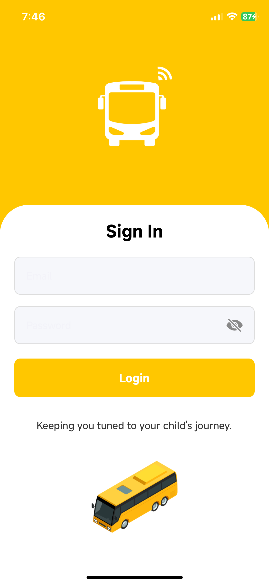
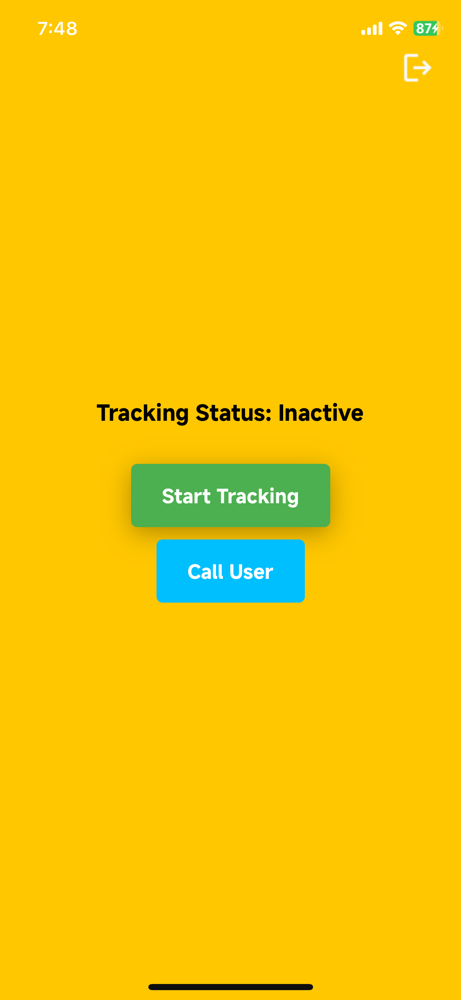
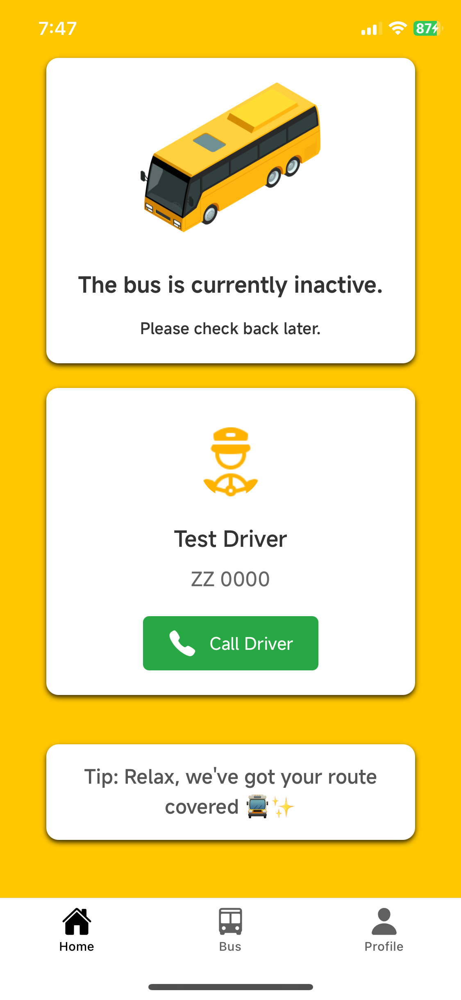
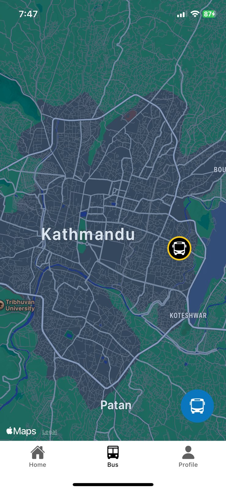

# Yatrack 🚍
Yatrack is a real-time location tracking system designed to improve school bus management and safety. This app enables drivers to update their bus's real-time location, sends notifications to parents or students as the bus approaches pick-up/drop-off points, and provides administrators with tools to manage fleet and routes.

## Features ✨

### Login/Authentication System
- Secure and robust auth system designed using firebase and react native logic.



### Driver Dashboard:
- Real-time Location Updates: Allows drivers to share their current location in real-time with the system.
- Proximity Notifications: Sends notifications to users when the bus is nearing their pick-up/drop-off points.
- Start/Stop Tracking: Drivers can activate or deactivate location tracking with a simple toggle.
- Offline Safety: Automatically stops tracking when the app goes into the background.



### User Interface:
- Real-Time Bus Tracking: Users can view the live location of their bus on a map.
- Route-Based Notifications: Receives alerts specific to their registered bus route and stop.





### Admin Tools:
- Fleet Management: Admins can monitor the status and location of all buses.
- Route Filters: Filter and display buses based on selected routes.
- Custom Notifications: Admins can send customized notifications to users.


## Tech Stack 🛠️
### Frontend:
- React Native: For enabling cross-platform application use.
- Expo: For development tools such as location services and font loading.


### Backend:
- Node.js & Express: API server to handle user and driver notifications.
- Firebase:
    - Realtime Database: For storing live bus locations and status.
    - Firestore: To manage user, driver, and route data.
    - Firebase Cloud Messaging (FCM): For push notifications.

### Additional Tools:
- Expo Keep Awake: Prevents the device from sleeping during active tracking.
- Haversine Formula: Calculates the distance between coordinates to trigger proximity alerts.
## Installation and Setup 🚀

#### 1.  Clone the Repository:

```bash
    git clone https://github.com/Ritsav/Yatrack.git
    cd Yatrack
```

#### 2. Install Dependencies
```bash
npm install
```

#### 3. Set Up Firebase:
- See the way to setup firebase in the Database.md documentation file.

#### 4. Update to latest expo version:
```bash
npx expo install expo@latest
```

#### 5. Add your Google Maps API in app.json:
- Change the text "YOUR_GOOGLE_MAPS_API_KEY" with your actual maps api.

#### 6. Run the Application:
```bash
npm start
```
## Usage 🏃‍♂️

- Drivers: Login and start tracking to share your location.
- Users: Register for notifications specific to your bus route and pick-up points.
- Admins: Use the fleet management portal to register, monitor, handle all buses & user data.
## Contributing 🤝

Contributions are always welcome! Please follow these steps:

#### 1. Fork the repository.

#### 2. Create a new branch:
```bash
git checkout -b feature-name
```

#### 3. Commit your changes and push:
```bash
git commit -m "Add a new feature"
git push origin feature-name
```

#### 4. Create a pull request.
## Authors

- [@Ritsav](https://www.github.com/Ritsav)
- [@Arpzdev](https://github.com/arpzdev)


## Background 

This was a small idea for a startup that I worked with along with my co-founder. In the process to try to bring forth this idea to fruition, we managed to build a complete product with a working database, backend and frontend but sadly enough, we couldn't work out the startup. 
